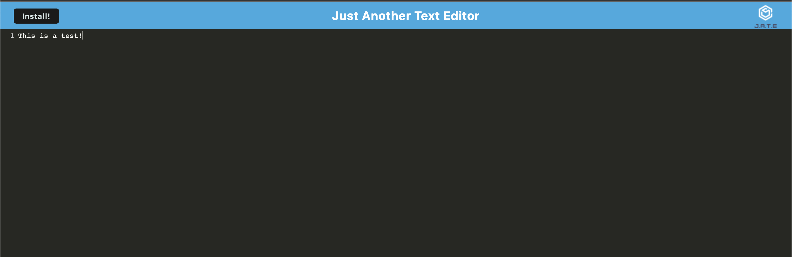

# Quick Text Editor

[](http://unlicense.org/)

## Description

My motivation for this project was to create an app that would allow me to quickly edit some text. I built it to test my skills as a junior developer. This app solves the problem of not being able to quickly edit text.

## Table of Contents

- [Installation](#installation)
- [Usage](#usage)
- [Contributing](#contributing)
- [Tests](#tests)
- [Questions](#questions)

### Installation

To install necessary dependencies, run the following command

```md
npm i ,
npm run start
```

### Usage

This app is very simple all you need to do is remember the link and you can start typing away.

### Contrnode ibuting

If you would like to contribute please fork the repo and send a pull request.

### Tests

To run tests, run the following command:

There are no tests for this code.

### Questions

Please contact me on Github, my username is jessemarino.



URL to Webpage: https://infinite-headland-27852.herokuapp.com/
