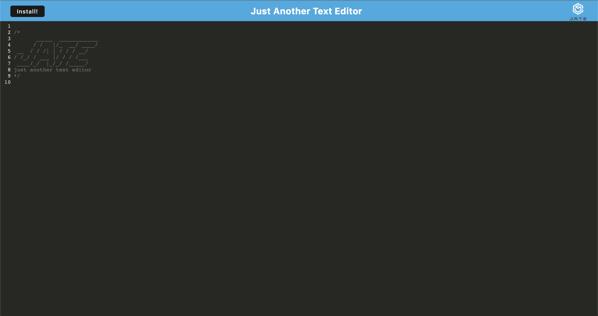

# Quick Text Editor

[](http://unlicense.org/)

## Description

My motivation for this project was to create an app that would allow users to quickly write and save notes. This app will keep all of your notes even if you leave or refresh the page. Use this app on the web or press the install button and use it locally!

## Table of Contents

- [Installation](#installation)
- [Usage](#usage)
- [Contributing](#contributing)
- [Questions](#questions)

### Installation

To install necessary dependencies run the following command

```md
npm init -y
npm i
```

### Usage

Run the following command to start the app:

```md
npm run start
```

Or Click on the link at the bottom of this readme!

### Contributing

If you would like to contribute please fork the repo and submit a pull request.

### Questions

If you have any questions please reach out via Github, my username is jessemarino.



URL to Webpage: https://infinite-headland-27852.herokuapp.com/
